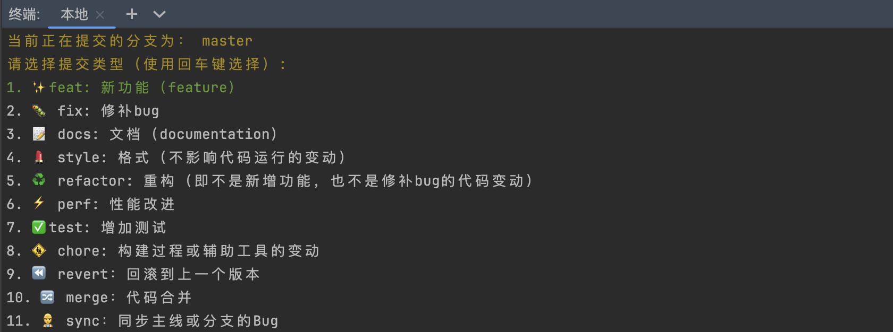
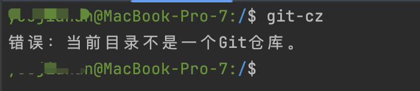
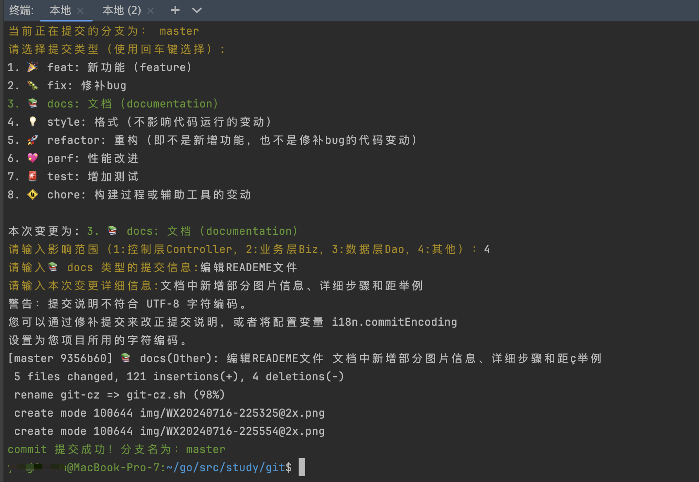
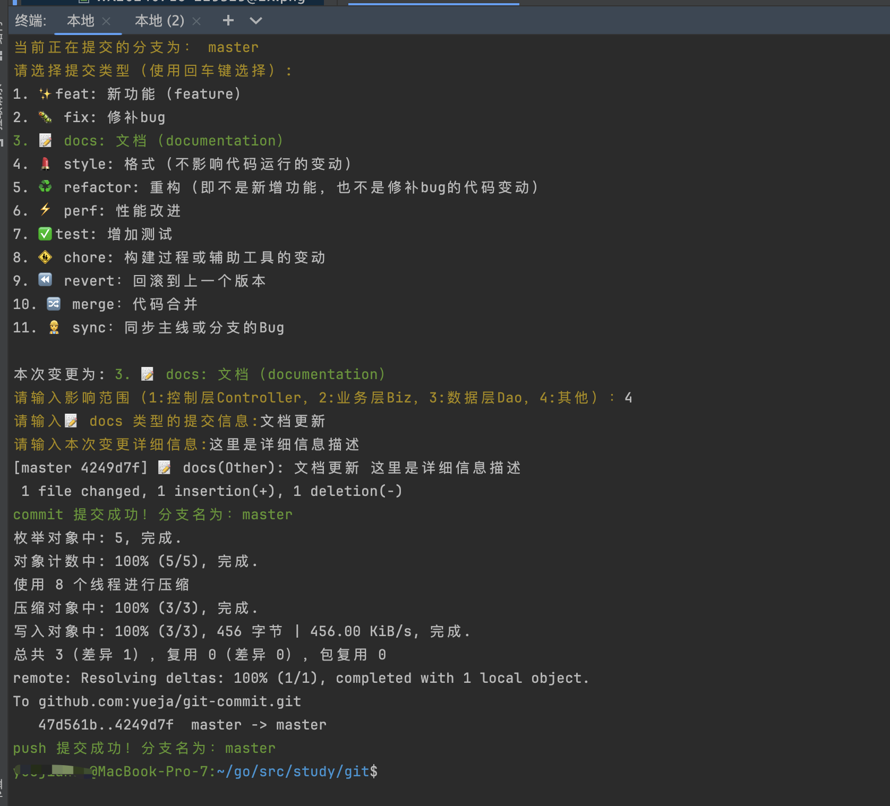

# git commit 规范介绍及工具使用

## 一、背景
在大多数人的编码体验中，写完代码后add .、commit -m xxx、push这几个步骤往往是最大快人心的，或者利用Goland等编辑器直接提交，但是这样提交的commit信息是相当不完善的，不利于迭代分支管理与维护。

## 二、git commit 规范
### 2.1 git commit 规范
对于一般的 commit，我们往往不需要过为详尽的阐述，言简意赅即可，所以，请使用以下的格式：
```xml
<type>(<scope>): <subject>
<BLANK LINE>
<body>
<BLANK LINE>
<footer>
```
其中最关键的是第一行的部分（除此以外的部分除非有特殊的要求，否则往往不用填写）：
```xml
<type>(<scope>): <subject>
```


### 2.2 Header
#### 2.2.1 type（必须）
用于说明git commit的类别，只允许使用下面的标识：

```shell
feat：添加新特性
fix/to：
   fix：产生 diff 并自动修复此问题。适合于一次提交直接修复问题
   to：只产生 diff不 自动修复此问题。适合于多次提交。最终修复问题提交时使用 fix
docs：仅仅修改了文档
style：仅仅修改了空格、格式缩进、逗号等等，不改变代码逻辑
refactor：代码重构，没有加新功能或者修复 bug
perf：优化相关，比如提升性能、体验
test：增加测试用例
chore：改变构建流程、或者增加依赖库、工具等
test：增加测试
revert：回滚到上一个版本
merge：代码合并
sync：同步主线或分支的Bug
```
如果不想使用这么生硬的文字，还可以通过更加有趣的 emoji 来表示咱么的提交类型，https://gitmoji.dev/ 罗列了我们可能用到的提交时使用的 emoji 并且提供了搜索功能，使用体验非常 nice，但是要注意，团队开发一定要在其他成员知道相关 emoji 含义的前提下使用。使用的方法就是

```
:emoji: (scope) subject
```

#### 2.2.2 scope（可选）
scope用于说明 commit 影响的范围，比如数据层（DAO）、控制层（Controller）、视图层（View）等等，视项目不同而不同。如果修改影响了不止一个 scope，你可以使用 * 代替。

#### 2.2.3 subject（必须）
subject 是 commit 目的的简短描述
- 不超过50个字符；
- 以动词开头，使用第一人称现在时，比如change，而不是changed或changes；
- 第一个字母小写；
- 结尾不加句号或其他标点符号

### 2.3 Body
Body 部分是对本次 commit 的详细描述，可以分成多行。Body编写有两个注意点。
```shell
1. 使用第一人称现在时，比如使用change而不是changed或changes。这有助于使描述更加直观和连贯，增强可读性。
2. 应该说明代码变动的动机，以及与以前行为的对比。 Body 部分不仅仅是描述代码的变动，还应该解释为什么进行这个变动，以及与之前的代码行为相比有哪些改进。这有助于其他开发者更好地理解代码变更的背后动机和意图。
```

### 2.4 Footer
Footer 部分只用于两种情况。

（1）不兼容变动

如果当前代码与上一个版本不兼容，则 Footer 部分以BREAKING CHANGE开头，后面是对变动的描述、以及变动理由和迁移方法。

（2）关闭 Issue

如果当前 commit 针对某个issue，那么可以在 Footer 部分关闭这个 issue 。


```shell
Closes #234

也可以一次关闭多个 issue
Closes #123, #245, #992
```

### 2.7 最后，我们的一个 commit message 可能长成这样：

```shell
fix(DAO):用户查询缺少username属性
通过增加字段来实现用户查询缺少username属性，并在详细逻辑中判断空值情况
Closes #234
```

```
feat(Controller):用户查询接口开发
新增查询接口，实现幂等，增加权限校验
Closes #245, #992
```

## 三、工具介绍
### 3.1 环境准备
```shell
git clone git@github.com:yueja/git-commit.git

# 将可执行文件cp到环境变量中，并添加权限
chmod 755 git-cz.sh

sudo mv git-cz.sh /usr/local/bin/git-cz.sh
```
### 3.2 使用方法
#### 1. 在git工程下执行git add .
#### 2. 执行git-cz命令


注：提交类型选项进行键盘上下左右箭进行选择；如果在非git工程下执行命令，错误如下：



#### 3. 根据提示输入相关信息



注：提交类型、影响范围、提交信息是必填项，详细信息选填项；
必填项都有校验、错误输入会有相关错误提示

#### 4. git push

#### 5. 提交记录效果


### 3.3 简单使用
将add，commit，push集成到一个命令，add 默认为当前目录，简化提交命令，使用命令
```shell
git-cz.sh -a
```
执行效果如下：



## 四、后期扩展（后续更新）
### 4.1 Go静态代码检查⼯具GolangCI-Lint介绍
GolangCI-Lint是⼀个lint聚合器，它的速度很快，平均速度是gometalinter的5
倍。它易于集成和使⽤，具有良好的输出并且具有最⼩数量的误报。⽽且它还⽀持go
modules

### 4.2 集成GolangCI-Lint
在代码提交前进行go代码增量扫描实现代码的自动code review功能，实现代码的规范性、可读性。
